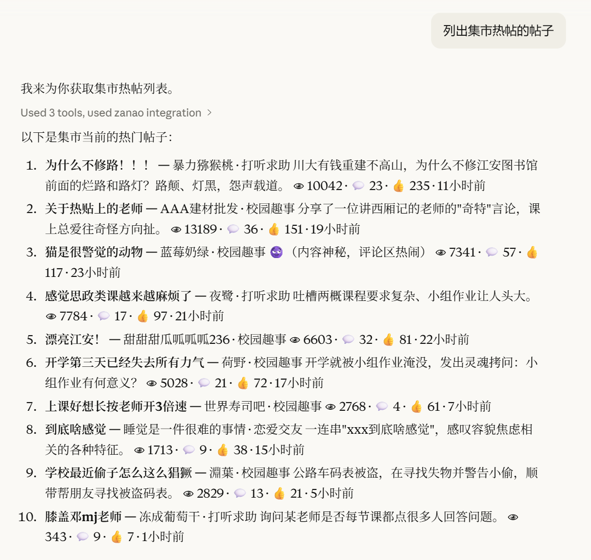
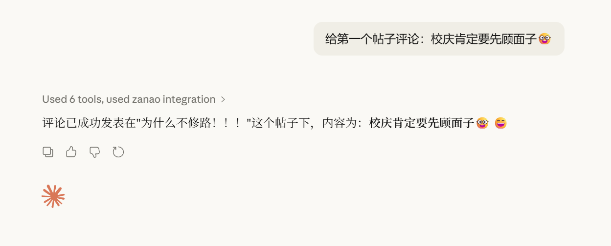

# ZanaoMCP

一个用于赞哦校园集市平台的 Model Context Protocol (MCP) 服务器，允许 AI 助手与赞哦校园集市进行交互。

## 功能特性

- **帖子浏览**：获取帖子列表、热门帖子、搜索帖子
- **帖子操作**：发布帖子、点赞/取消点赞、修改帖子状态
- **评论管理**：查看评论、发表评论、点赞/取消点赞评论、删除评论
- **用户信息**：获取用户信息、消息通知
- **分类浏览**：获取帖子分类列表

## 安装

### 前提条件

- Go 1.25.0 或更高版本

### 从源码构建

```bash
git clone https://github.com/jeanhua/ZanaoMCP.git
cd ZanaoMCP
go build -o zanao-mcp
```

## 配置

在使用之前，需要设置以下环境变量：

| 环境变量 | 说明 | 示例 |
|---------|------|------|
| `ZANAO_TOKEN` | 赞哦平台的用户 Token | `your_token_here` |
| `ZANAO_SCHOOL_ALIAS` | 学校别名 | `scu` |

### 获取 Token

1. 登录赞哦微信小程序平台
2. 在抓包工具中(推荐Fiddler Classic)查看网络请求
3. 从请求头中找到 `X-Sc-Od` 字段

## 使用

### 在 Claude Desktop 中使用

在 Claude Desktop 配置文件中添加：

**macOS**: `~/Library/Application Support/Claude/claude_desktop_config.json`

**Windows**: `%APPDATA%/Claude/claude_desktop_config.json`

```json
{
  "mcpServers": {
    "zanao campus market": {
      "command": "/path/to/zanao-mcp",
      "env": {
        "ZANAO_TOKEN": "your_token",
        "ZANAO_SCHOOL_ALIAS": "your_school_alias, e.g. scu"
      }
    }
  }
}
```





## 可用工具

### 帖子相关

| 工具名 | 描述 |
|-------|------|
| `list_posts` | 获取帖子列表，支持分页 |
| `hot_posts` | 获取热门帖子列表 |
| `search_posts` | 在当前分类搜索帖子 |
| `search_history_posts` | 搜索历史帖子 |
| `create_post` | 发布新帖子 |
| `like_post` | 点赞帖子 |
| `unlike_post` | 取消点赞帖子 |
| `change_post_status` | 修改帖子状态 |

### 评论相关

| 工具名 | 描述 |
|-------|------|
| `get_comments` | 获取帖子评论列表 |
| `post_comment` | 发表评论 |
| `delete_comment` | 删除评论 |
| `like_comment` | 点赞评论 |
| `unlike_comment` | 取消点赞评论 |

### 用户相关

| 工具名 | 描述 |
|-------|------|
| `get_user_info` | 获取当前用户信息 |
| `get_messages` | 获取用户消息列表 |
| `get_categories` | 获取帖子分类列表 |

## 项目结构

```
ZanaoMCP/
├── main.go           # 程序入口
├── server/           # MCP 服务器实现
│   └── server.go
├── tools/            # MCP 工具定义
│   ├── post.go       # 帖子相关工具
│   ├── comment.go    # 评论相关工具
│   ├── user.go       # 用户相关工具
│   └── client.go     # 客户端初始化
└── zanao/            # 赞哦 API 客户端
    ├── zanao.go      # 客户端实现
    ├── model.go      # 数据模型
    └── header.go     # 请求头配置
```

## 依赖

- [go-resty/resty](https://github.com/go-resty/resty) - HTTP 客户端
- [modelcontextprotocol/go-sdk](https://github.com/modelcontextprotocol/go-sdk) - MCP Go SDK

## 许可证

[MIT License](LICENSE)

## 贡献

欢迎提交 Issue 和 Pull Request！

## 免责声明

本项目为第三方开源项目，与赞哦官方无关。使用本项目时请遵守赞哦平台的使用条款和相关法律法规，作者不承担任何因使用本项目而导致的问题。
